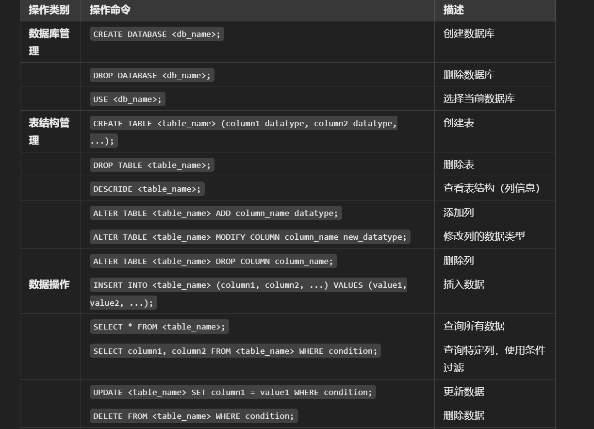

# 常用操作

连接到数据库 `mysql -u username -p`

退出 `etit;`

## **查看数据库和表**

查看所有数据库

**选择数据库**：

**查看当前数据库**：

查看当前数据库中的所有表：

**查看表的结构**（列信息、数据类型等）：

## 创建、删除和修改数据库

**创建数据库**：

**删除数据库**：

**修改数据库**（如更改字符集）：
