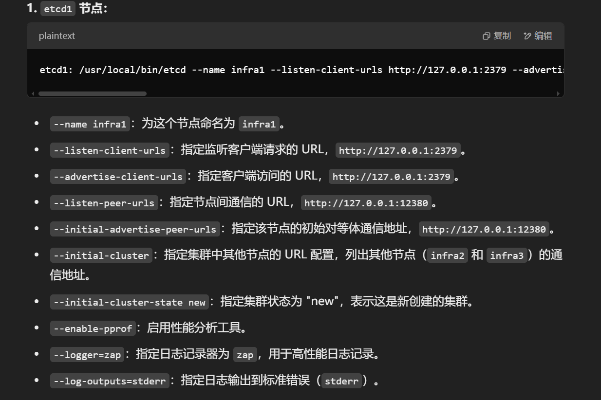
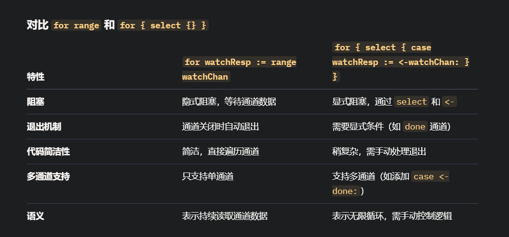

```
git add .
git commit -m "Your commit message"
git push
```


搞清楚关系。。


protoc --go_out=. --go_opt=paths=source_relative --go-grpc_out=. --go-grpc_opt=paths=source_relative cachepb/cachepb.proto




